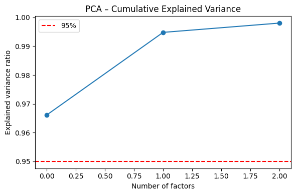
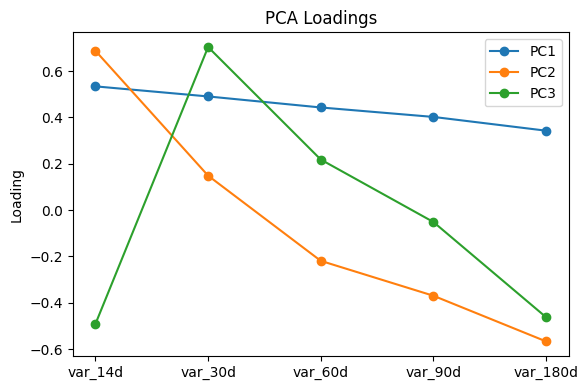
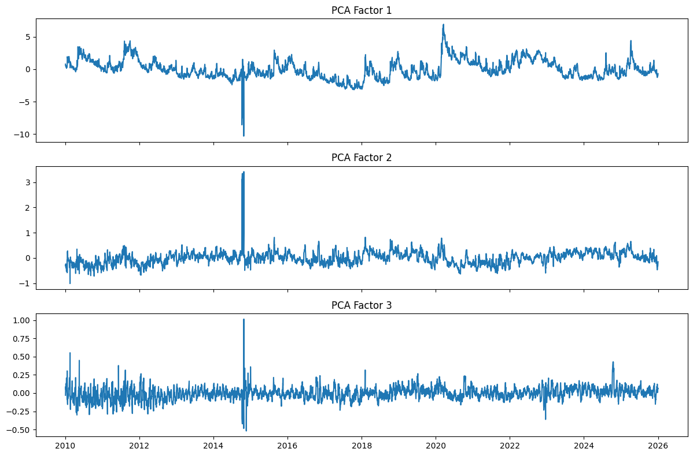
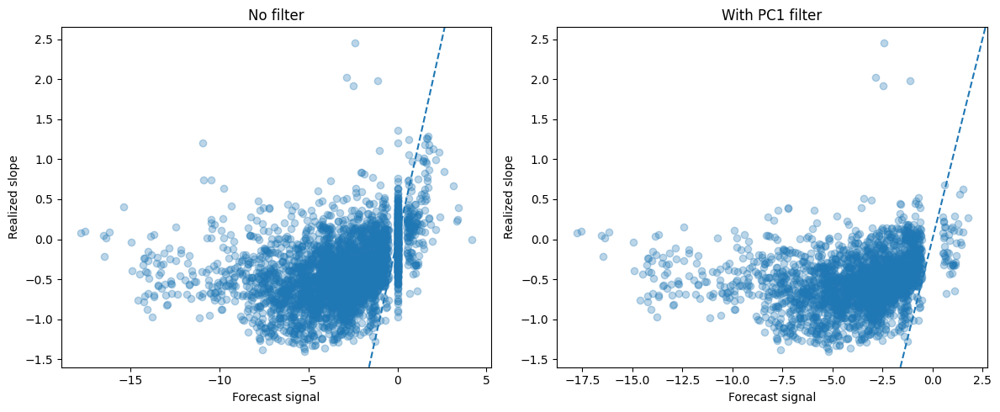
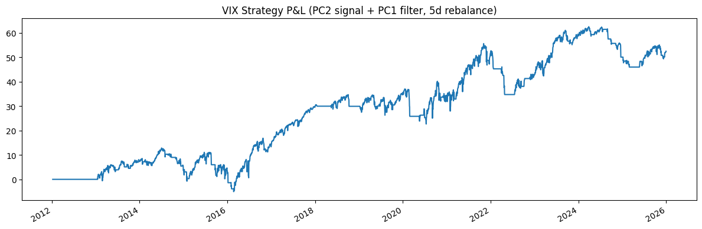
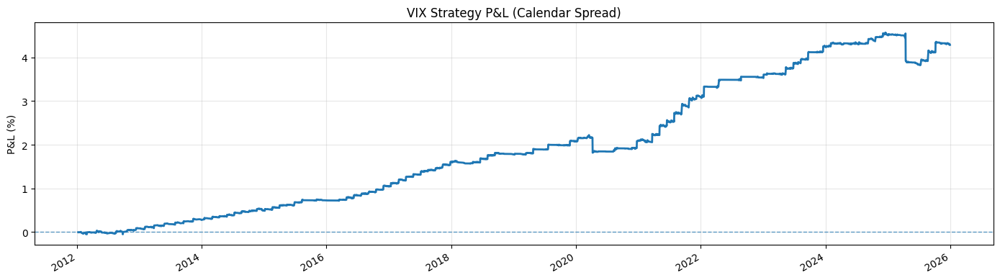

# Volatility-Term-Structure-Trading

**Forecasting the SPX implied volatility term structure with PCA and AR(1) — powering two live-signal strategies on 15 years of options data.**

---

## Table of Contents

1. [Overview](#overview)
2. [Data](#data)
3. [Pre-Processing](#pre-processing)
4. [Methodology](#methodology)
5. [Forecasting Results](#forecasting-results)
6. [Strategy I — VIX Futures](#strategy-i--vix-futures)
7. [Strategy II — Calendar Spreads](#strategy-ii--calendar-spreads)
8. [Repository Structure](#repository-structure)
9. [Team](#team)

---

## Overview

Implied volatility is not flat across maturities, it forms a term structure that shifts, tilts, and bends over time in response to market conditions. This project treats that term structure as a low-dimensional dynamical system, forecasts its evolution using a rolling PCA + AR(1) framework, and translates the forecast into two independent trading strategies that share the same signal engine.

The core insight driving the entire project is that **the slope of the ATM implied variance curve is forecastable** out-of-sample at a 5-day horizon. This single result, obtained rigorously before any strategy was designed, is what motivated all downstream work.

The pipeline flows as follows:

```
Raw SPX options data (2.3M rows, 2010–2025)
        │
        ▼
  Pre-processing: forward price, risk-free rate, IV mid, log-moneyness
        │
        ▼
  ATM variance term structure (5 maturities × daily panel)
        │
        ▼
  PCA decomposition → 3 factors (level, slope, curvature)
        │
        ▼
  Rolling AR(1) walk-forward backtest (no lookahead)
        │
        ▼
  Slope forecast + PC1 regime filter
        ┌──────────────┴──────────────┐
        ▼                             ▼
 VIX Futures Strategy       Calendar Spread Strategy
```

---

## Data

Two data sources are used, both covering January 2010 to December 2025.

**SPX options**: every listed strike and expiry, approximately 2.3 million rows. Each row includes bid, ask, implied volatility, Greeks (delta, gamma, vega, theta), open interest, and volume.

**SPX daily close prices**: used to compute spot-to-forward distance and to anchor ATM strike selection.

**VX continuous futures** (absolute-price adjusted): used as the trading instrument for Strategy I.

---

## Pre-Processing

Before any modelling, three quantities are derived from the raw data.

**Forward price and risk-free rate** are estimated jointly via put-call parity. For each (trade date, expiry) pair, the call-put spread $C - P$ is regressed on strike $K$:

$$C - P = DF \cdot (F - K) \quad \Longrightarrow \quad C - P = a - b \cdot K$$

where $b = DF = e^{-rT}$ and $a = DF \cdot F$. This gives an arbitrage-free forward price $F$ and discount factor $DF$ without requiring an external rate source.

**Log forward-moneyness** is defined as:

$$m = \log\left(\frac{K}{F}\right)$$

This is the natural distance measure in option pricing: it is symmetric around the forward, accounts for cost of carry, and is directly linked to the log-normal assumption underlying Black-Scholes and Black-76.

**IV mid** is the average of bid-IV and ask-IV:

$$\sigma_{\text{mid}} = \frac{\sigma_{\text{bid}} + \sigma_{\text{ask}}}{2}$$

This is used throughout as a clean, spread-neutral estimate of market-implied volatility.

---

## Methodology

### Step 1 — ATM Variance Term Structure

For each trading day and each expiry, the at-the-money point is defined as the strike minimising $|m|$. The ATM implied variance is estimated as a **vega-weighted average** across the ATM slice:

$$\hat{\sigma}^2_{\text{ATM}}(T) = \frac{\sum_i \sigma^2_i \cdot \mathcal{V}_i}{\sum_i \mathcal{V}_i}$$

Vega weighting gives higher importance to options with greater sensitivity to volatility, reducing the influence of illiquid or wide-spread contracts. The five nearest real expiries to target maturities of 14, 30, 60, 90, and 180 DTE are selected, producing a daily panel of shape $(T \times 5)$.

### Step 2 — PCA on Log-Variance

PCA is applied to the **log-variance** panel after demeaning:

$$X = \log\hat{\sigma}^2_{\text{ATM}} - \mu$$

Log-variance is preferred over raw variance because it is approximately Gaussian, stabilises heteroskedasticity across maturities, and guarantees positivity of any reconstructed surface. Three principal components are retained.

|  |  |
|:---:|:---:|
| *Cumulative explained variance — 3 factors are sufficient* | *Loadings: PC1 = level, PC2 = slope, PC3 = curvature* |

The three factors have a canonical economic interpretation: **PC1** captures the overall level of implied variance (correlated with VIX), **PC2** captures the slope of the curve (contango vs. backwardation), and **PC3** captures its curvature.

### Step 3 — Factor Analysis and Model Selection

Before fitting any forecasting model, stationarity and mean-reversion speed are verified for each factor.

|  |
|:---:|
| *PC1, PC2, PC3 time series — all stationary by ADF test (p = 0.000)* |

| Factor | ADF p-value | Half-life (days) | Included in AR(1) |
|--------|:-----------:|:----------------:|:-----------------:|
| PC1 (level) | 0.000 | 15.3 | ✓ |
| PC2 (slope) | 0.000 | 3.8 | ✓ |
| PC3 (curvature) | 0.000 | 1.6 | ✗ |

All three factors are stationary, validating mean-reverting AR(1) dynamics. The half-life of PC3 (1.6 days) is shorter than the forecast horizon (5 days), meaning its signal is fully dissipated before any trade is executed — **PC3 is therefore excluded from the AR(1) model**. This is a data-driven decision, not a modelling assumption.

### Step 4 — Rolling Walk-Forward Backtest

For each retained factor $k \in \{1, 2\}$, an AR(1) is estimated on a rolling 504-day window and iterated $H = 5$ times:

$$\hat{f}^{(k)}_{t+h} = \hat{a}_k + \hat{b}_k \cdot \hat{f}^{(k)}_{t+h-1}$$

The forecast is projected back to log-variance space through the current loading matrix $B$:

$$\hat{X}_{t+H} = \hat{F}_{t+H} \cdot B + \mu$$

The term structure slope is reconstructed as:

$$\text{slope}_{t+H} = \hat{X}_{t+H}^{(14\text{d})} - \hat{X}_{t+H}^{(180\text{d})}$$

The backtest is strictly walk-forward: **PCA and AR(1) parameters are re-estimated at every step using only past data**. No future information enters any estimation window.

---

## Forecasting Results

The out-of-sample slope forecast achieves a **correlation of 0.652** with the realised slope at a 5-day horizon.

|  |
|:---:|
| *Forecast vs realised slope, coloured by PC1 regime — low-vol periods (green) cluster tightly around the diagonal; high-vol periods (red) show greater dispersion* |

This scatter plot directly motivated the introduction of a **PC1 regime filter**. When PC1 exceeds 1 standard deviation above its 252-day rolling mean, signalling an abnormally elevated volatility environment, the model's directional accuracy degrades. The filter suppresses signals in these periods. This is not a post-hoc adjustment: the regime-dependent degradation in forecast quality is visible in the diagnostics before any strategy is constructed.

| Metric | No filter | With PC1 filter |
|--------|:---------:|:---------------:|
| Coverage | 89.9% | 70.1% |
| Directional hit-rate | 86.5% | **90.7%** |

Removing 19.8% of trading days improves the hit-rate by 4.2 percentage points, confirming that the filtered observations are disproportionately low-quality predictions.

---

## Strategy I — VIX Futures

### Signal Construction

The slope forecast is normalised into a z-score over a 60-day rolling window. Only forecasts with $|z| > 0.5$ are treated as actionable (noise filter). The PC1 regime filter then suppresses signals when the volatility level is abnormally elevated. The final position is binary, long or short the VX front-month continuous future, and rebalanced every 5 trading days with a 1-day execution lag to prevent same-day information from entering the position.

### Results

|  |
|:---:|
| *Cumulative P&L vs always-short-VIX benchmark (in VIX points, 2012–2025)* |

| Metric | Value |
|--------|:-----:|
| Sharpe Ratio | 0.36 |
| Max Drawdown | −20.86 VIX pts |
| Active days | 68.7% |

The benchmark (always short VIX) exploits the structural negative risk premium embedded in volatility futures. The signal-driven strategy improves risk-adjusted performance by selectively reducing exposure during regimes where the premium is unreliable or reversed.

---

## Strategy II — Calendar Spreads

### Construction

A calendar spread trades the term structure slope directly in option space, avoiding the basis risk inherent in VIX futures. Each day, the ATM call with DTE closest to 30 (window: 20–40 days) and the ATM call closest to 60 (window: 50–70 days) are selected. A **long calendar** (sell 30d, buy 60d) profits when short-term IV rises relative to long-term IV; a **short calendar** profits in the opposite regime.

The same slope forecast and PC1 regime filter from Strategy I drive the entry logic. Position sizing (0–3 contracts) is scaled by the absolute magnitude of the forecast and penalised by one size level during elevated-stress regimes. An aggressiveness parameter (1–10) controls the threshold mapping, making the rule fully interpretable and tunable without retraining.

Transaction costs are modelled explicitly: entries cross the bid-ask spread, and slippage versus mid is accumulated as a realised cost.

### Results

|  |
|:---:|
| *Calendar spread cumulative P&L and drawdown — initial capital $100,000* |

The codebase includes full Greeks attribution (vega, theta, gamma, delta), performance decomposition by PC1 regime, signal strength quartile analysis, and a Probability of Backtest Overfitting (PBO) validation.

---

## Repository Structure

```
├── mda_analysis.py          # Full pipeline: loading → PCA → backtest → both strategies
├── images/                  # Static plots embedded in this README
│   ├── pca_explained_variance.png
│   ├── pca_loadings.png
│   ├── factor_timeseries.png
│   ├── slope_scatter_regime.png
│   ├── vix_pnl.png
│   └── calendar_pnl_drawdown.png
└── README.md
```

> **Data files** (`df_fwd_full.csv`, `VX_full_1day_continuous_absolute_adjusted.csv`) are not included due to size. Input paths are configured in the `CONFIGURATION` block at the top of `mda_analysis.py`.

---

## Team

<!-- Replace name, degree, and university fields. Add a team photo above the table if desired. -->

| Name | Degree | University |
|------|--------|------------|
| Marco Eichenberg | Mathematics | VU University Amsterdam |
| Derek Nigten | Econometrics & Data Science | VU University Amsterdam |
| Alessandro Plett | Quantitative Finance & Risk Management | Univeristà Bocconi |

---

*Built with Python — NumPy · pandas · scikit-learn · statsmodels · SciPy · matplotlib*
